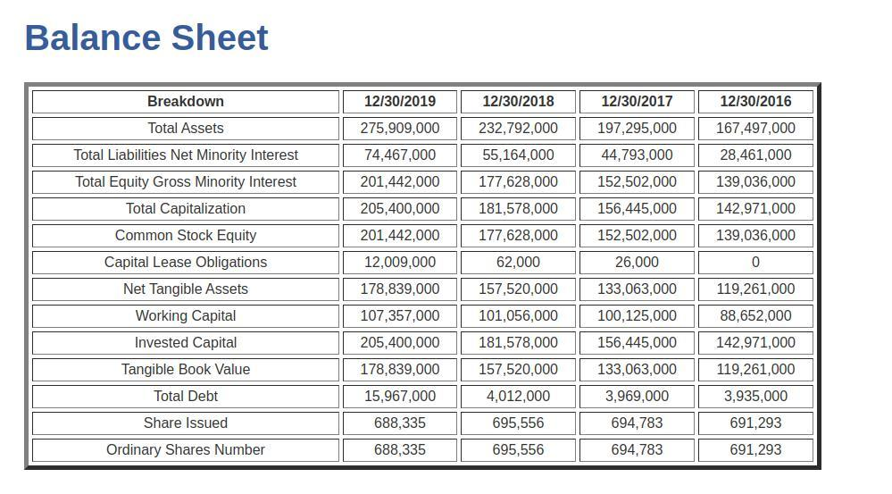

Simple app created using Angular 6, Django rest framework and BeautifulSoup


### setup environment:
```
virtualenv -p python3.7 .venv
source .venv/bin/activate
pip install -r requirements.txt
```
## Run api server
```
cd backend
python manage.py runserver
```
## Parse  and store data from https://finance.yahoo.com/quote/GOOG/balance-sheet into db

```
python manage.py parse_into_db

```
## Run client server 

```
cd frontend
ng serve --open
```
## Sample output 
